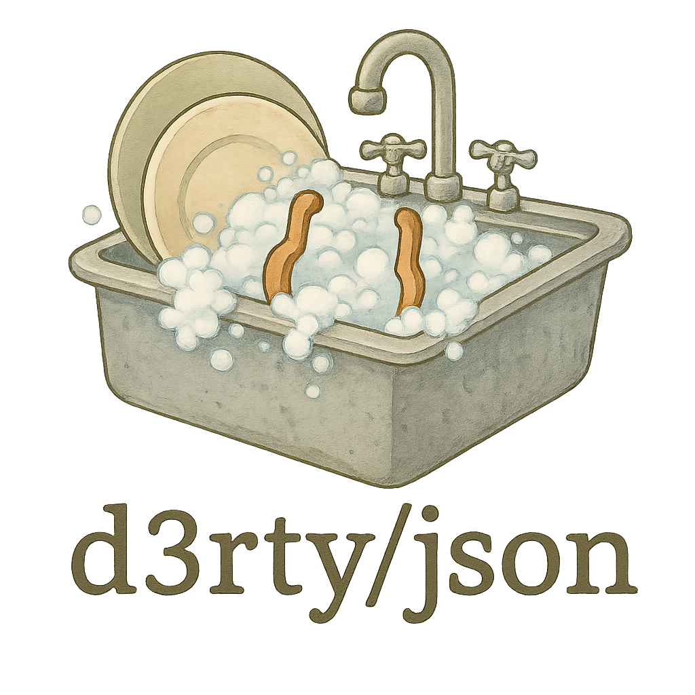

# d3rty/json 🧼

<p align="center">
  <br>
</p>
<h3 align="center">Flexible JSON unmarshalling for Go:</h3>
<h4 align="center"><em>Gracefully handling schema variations and forgiving mistakes.</em></h4>


> 🚧 Project is a `Work In Progress` thing.

## Overview

**d3rty/json** is a robust Go library for parsing JSON data from third-party sources you can’t fully control or trust.
It’s built to handle real-world, unpredictable JSON — whether you're dealing with schema flakiness like stringified integers,
inconsistent key naming (camelCase vs. snake_keys), or even quirks introduced by AI-generated data.
With a forgiving approach to unmarshalling, d3rty/json ensures your application continues to work reliably while still capturing
as much meaningful data as possible.

## Key Features

- **Flexible Unmarshalling:**
  Attempts standard decoding first and then gracefully falls back to a more flexible decoding when encountering schema variations.

- **Custom Data Types:**
  Provides custom types (such as `Number`, `String`, `Bool`, `Array`, and `Object`) that are designed to interpret JSON values even when they deviate from the standard.

- **Seamless Integration:**
  Designed to work as a drop-in replacement for the standard library’s `json.Unmarshal`, `json.NewDecoder` allowing you to easily switch without rewriting your models.

- **Error & Warning Reporting:**
  Incorporates a system of result colors (🟢 Green, 🟡 Yellow, 🔴 Red) to signal the quality of the unmarshalling process—whether it was clean, achieved through forgiving conversions, or partially lossy.

## Installation

After `go get github.com/d3rty/json` you can simply import the package into your code:

```go
import "github.com/d3rty/json"
```

## Usage

```go
package main

import (
    "fmt"
    "log"

    dirty "github.com/d3rty/json"
)

// Event is a classical "clean" model.
// Types are strict.
type Event struct {
    dirty.Enabled // Enables dirty unmarshalling.

    Name   string `json:"name"`

    // These fields will be rewritten in dirty schema.
    // In case if they were dirty-read (stringified integers, etc.) - they are still valid. (Yellow Mode)
    ID       int    `json:"id"`
    IsActive bool   `json:"is_active"` // this will be read as is_active/IsActive/is-active, etc.

    // MustBool won't be rewritten in dirty schema. So this field MUST be bool or ignored (Red Mode).
    MustBool bool `json:"must_bool"`
}

// Dirty method links the clean model to its dirty variant.
func (e *Event) Dirty() any {
    // Both inline or defined type work here.
    return &struct {
      ID       dirty.Number `json:"id"`
      IsActive dirty.Bool   `json:"is_active"`
    }{}
}

func main() {
    // No data loss, we forgave all the mistakes:
    data := []byte(`{"id": "123", "name": "Sample Event", "IsActive": "on", "must_bool": true}`)
    var event Event

    if err := dirty.Unmarshal(data, &event); err != nil {
      log.Fatalf("error unmarshalling: %v", err)
    }

    // We successfully marshaled, fixing all the mistakes that we forgave (Yellow mode):
    fmt.Println(event.ID) // 123
    fmt.Println(event.IsActive) // true
    fmt.Println(event.MustBool) // true

    // Unparsable value on the strict (clean) field:
    // We couldn't fix all the mistakes, so we lost the data (Red mode):
    data = []byte(`{"id": "123", "name": "Sample Event", "IsActive": "on", "must_bool": "true"}`)

    event = Event{}
    if err := dirty.Unmarshal(data, &event); err != nil {
      log.Fatalf("error unmarshalling: %v", err)
    }

    fmt.Println(event.ID) // 123
    fmt.Println(event.IsActive) // true
    fmt.Println(event.MustBool) // false (Because it's not declared in a dirty scheme)
}
````
